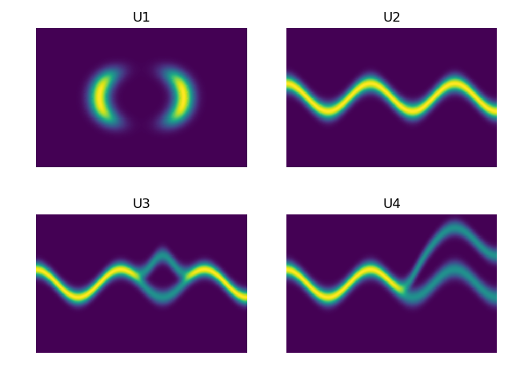
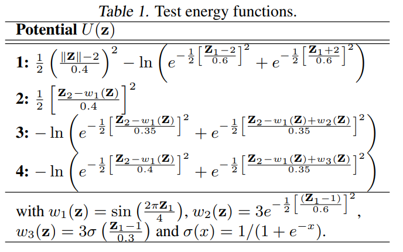

# Variational Inference with Normalizing Flows
Implementation of paper [Variational Inference with Normalizing Flows](https://arxiv.org/abs/1505.05770) section 6.1 experiments.

This experiment visually demonstrates that **Normalizing Flows** can successfully transform a simple 
initial simple distribution q_0(z) to much better approximate some known non-Gaussian Bi-variate 
distribution p(z).

The distributions that we want to learn is as followings:

We want to learning the Bi-variate distribution of Z(Z1, Z2). Equation for each of the distribution could be found at paper.

Then, our **goal** is to transfer some simple distribution to the target distribution by Normalizing Flows.
We will select Normal distribution as the simple distribution and then transfer simple standard Normal distribution to the complex target distribution.

# Training Criteria
The known target distributions are specified using energy functions U(z).
p(z) = \frac{1}{Z} e^{-U(z)}, where Z is the unknown partition function (normalization constant); 
that is, p(z) \prop e^{-U(z)}.

# TODO
* Add IAF

# Reference

[vae-normflow](https://github.com/16lawrencel/vae-normflow)

[Reproduce results from sec. 6.1 in "Variational inference using normalizing flows" ](https://github.com/casperkaae/parmesan/issues/22)

[parmesan/parmesan/layers/flow.py](https://github.com/casperkaae/parmesan/blob/master/parmesan/layers/flow.py)

[wuaalb/nf6_1.py](https://gist.github.com/wuaalb/c5b85d0c257d44b0d98a)